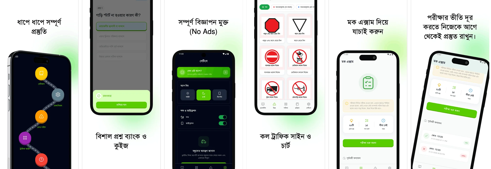

# BRTA Driving Exam Prep: Bangla



Prepare for the BRTA Driving License Written and Viva Exams completely—without any ads! This is an open-source Mobile application designed to help users in Bangladesh master traffic laws and road signs through an interactive, gamified experience.

<a href="https://play.google.com/store/apps/details?id=pro.momin.driving_shikkha">
  
</a>

**App Store (iOS)**: Coming Soon!

Worried about passing the driving license exam? Or don't have a proper understanding of traffic laws and road signs? The **BRTA Driving Exam Prep: Bangla** app will remove your fear and help you prepare effectively for the exam.

**Main Purpose of the App**:
The goal of this app is not only to help you pass the exam but also to make the general public aware of important traffic rules and safe driving practices. Specifically, our goal is to provide an idea of the questions that usually come in the BRTA exam and give users an opportunity to test their knowledge.

We believe—_"Only the right knowledge can reduce accidents and create a responsible driver."_

**Key Features**:

- **Step-by-step Learning Roadmap**: Follow our well-organized roadmap instead of reading randomly. Basics, mechanisms, road signs, and traffic laws—everything is organized chapter-wise.
- **Rich Question Bank**: Access important questions from previous years' exams. Instant feedback helps you learn and correct mistakes.
- **Traffic Sign Recognition**: Zoomable charts for Mandatory, Warning, and Informative signs.
- **Mock Exam**: Test your preparation with a practice test before the real exam.
- **Dark Mode & Customization**: Eye-friendly dark mode and sound/vibration toggle options.
- **Halal & Safe Sound**: All sound effects are non-musical and safe to use, powered by `flutter_soloud`.
- **100% Ad-Free**: Prepare without any interruptions.

## Technical Architecture & Stack

This project follows modern Flutter development best practices with a focus on maintainability, performance, and a premium user experience.

### Core Framework & UI

- **Framework**: [Flutter](https://flutter.dev/) (Channel Stable)
- **UI System**: [Shadcn UI for Flutter](https://pub.dev/packages/shadcn_ui) — used for high-quality, customizable components following the Radix UI philosophy.
- **State Management**: [Riverpod 3.0](https://riverpod.dev/) with **Code Generation** for type-safe, compile-time checked state management.
- **Navigation**: [GoRouter](https://pub.dev/packages/go_router) — Declarative routing for deep linking and seamless transitions.
- **Typography**: [Google Fonts](https://pub.dev/packages/google_fonts) combined with **SolaimanLipi** for optimized Bengali text rendering.

### Data & Logic

- **Local Database**: [Sembast](https://pub.dev/packages/sembast) — A NoSQL persistent database for complex data structures like user progress and question states.
- **Key-Value Storage**: [Shared Preferences](https://pub.dev/packages/shared_preferences) for simple app settings.
- **Models & Serialization**: [Freezed](https://pub.dev/packages/freezed) and [JSON Serializable](https://pub.dev/packages/json_serializable) for robust, immutable data models.

### User Experience & Utilities

- **Audio Engine**: [Flutter SoLoud](https://pub.dev/packages/flutter_soloud) — Low-latency, high-performance audio engine for non-musical sound effects.
- **Animations**: [Animations package](https://pub.dev/packages/animations) for material motion and custom transitions.
- **Vector Graphics**: [Flutter SVG](https://pub.dev/packages/flutter_svg) for crisp, resolution-independent road signs.
- **Feedback**: [Flutter Confetti](https://pub.dev/packages/flutter_confetti) for celebration effects.

## Getting Started

### Prerequisites

- Flutter SDK (latest stable recommended)
- [FVM](https://fvm.app/) (Optional but recommended for version consistency)

### Setup

1.  **Clone the repository**:

    ```bash
    git clone https://github.com/yourusername/brta_driving_exam_prep.git
    ```

2.  **Install dependencies**:

    ```bash
    fvm flutter pub get
    ```

3.  **Run Code Generation**:
    The project relies heavily on code generation for Riverpod and Freezed.

    ```bash
    fvm flutter pub run build_runner build --delete-conflicting-outputs
    ```

4.  **Run the app**:
    ```bash
    fvm flutter run
    ```

## Contributing

Contributions are what make the open-source community such an amazing place to learn, inspire, and create. Any contributions you make are **greatly appreciated**.

1. Fork the Project
2. Create your Feature Branch (`git checkout -b feature/AmazingFeature`)
3. Commit your Changes (`git commit -m 'Add some AmazingFeature'`)
4. Push to the Branch (`git push origin feature/AmazingFeature`)
5. Open a Pull Request

**Note on Question Bank**: If you'd like to add or correct questions, please look into `assets/data/questions/`.

## License

Distributed under the **MIT License**. See `LICENSE` for more information.

## DISCLAIMER & DATA SOURCE

This application is an independent educational tool and is **NOT** affiliated with, endorsed by, or connected to the Bangladesh Road Transport Authority (BRTA) or the Government of Bangladesh.

**Source of Information**: All information provided in this app regarding traffic rules, signs, and exam procedures is collected from publicly available data on the official BRTA website and related government publications:
[https://brta.gov.bd/](https://brta.gov.bd/)

---

_Helping you drive safely, one question at a time._
